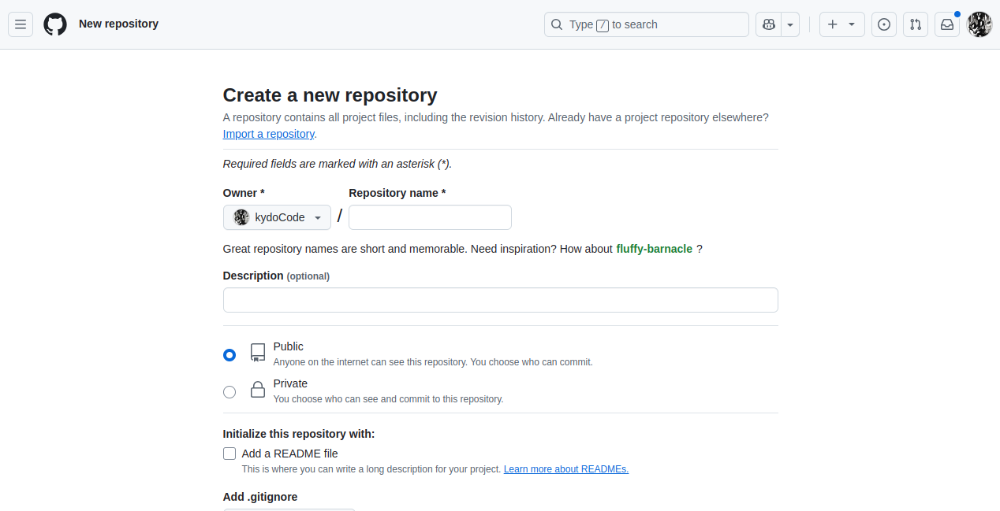

# Tuto 101 - Git/GitHub pour projets Unity (Versioning en CLI) - by Kydo

---

**Préambule:** Ce tutoriel est présenté en contexte
de projets Unity mais les commandes et conseils s'appliquent à tout projet de code.

**Le versioning, c'est quoi ?** 

Le versioning permet, à l'image d'un document texte ou Word auquel on ajouterait des chiffres au nom du fichier à chaque sauvegarde pour distinguer les évolutions au fur et à mesure qu'on apporte des modifications (v1, v2, v3...), de suivre l'évolution d'un projet, de revenir à une version antérieure et de collaborer sans écraser le travail des autres.

Git est un outil local de versioning, et GitHub un hébergement distant pour partager ton code. Ils remplissent exactement la même fonction que les v1 v2 et v3 qu'on ajoute à notre fichier Word, et bien plus.

## Git vs GitHub

* **Git** : installé sur ta machine, gère le versioning localement.
* **GitHub** : héberge tes dépôts Git en ligne, permet de collaborer.

> Autres alternatives : GitLab, Bitbucket, etc.

### 🧩 Prérequis

* Installer Git sur ta machine : [https://git-scm.com/downloads](https://git-scm.com/downloads)
* Créer un compte GitHub : [https://github.com](https://github.com)

## Où passer les commandes ?

Dans **VS Code**, ouvre le **Terminal** avec :

```
Ctrl + ` (accent grave)
```

Ou via le menu `Terminal > Nouveau terminal`

---

## I - Projets solo

## 🚀 Initialisation d'un projet solo (une seule fois par projet)

### 1. Initialiser le dépôt (une seule fois)

**ATTENTION:** Assurez vous d'être bien dans votre dossier projet et pas à un autre niveau avant de faire le git init. En cas d'erreur: supprimer le fichier .git et recommencer la commande (afficher les fichiers cachés pour le voir).

```bash
git init
```
Git va alors commencer à suivre toutes les modifications qui surviennent dans le dossier, peu importe lesquelles.
Pour des raisons de sécurité et afin d'éviter des conflits liés à des fichiers systèmes, on voudra ignorer délibérement certains fichiers et créer dès le départ un fichier qui va référencer ces ommissions: un .gitignore (à créer à la racine du projet).

```bash
touch .gitignore
```

Voir sections [Quand générer un fichier `.gitignore` ?](#quand-générer-un-fichier-gitignore-) et [Template `.gitignore` fiable pour un projet Unity](#template-gitignore-fiable-pour-un-projet-unity) ci-après pour un template `.gitignore` spécifique aux projets Unity.


### 2. Renommer la branche principale en `main` (une seule fois)

```bash
git branch -M main
```

### 3. Créer (en ligne, dans GitHub) et lier (dans le terminal de VS Code) le dépôt distant GitHub (une seule fois)



```bash
git remote add origin https://github.com/tonUser/nomDuRepo.git
```

### 4. Premier push

```bash
git add .
git commit -m "Init: version initiale du projet"
git push -u origin main
```

---

## ⚠️ Quand générer un fichier `.gitignore` ?

Le fichier `.gitignore` sert à indiquer à Git quels fichiers ou dossiers **ne pas suivre**, comme les fichiers temporaires, les dossiers de build, les configurations locales, etc.

**Conseil**: 

Crée toujours ton `.gitignore` **au début du projet**, avant de faire ton premier commit, pour éviter de versionner des fichiers inutiles ou volumineux.
**Astuce**: Voir ce site pour générer un template selon le projet en cours: gitignore.io

---

## 🔁 Cycle de versioning solo (à chaque modification)

```bash
git add .
git commit -m "Update: correction collisions 3D"
git push
```

> Si tu travailles dans une branche autre que `main`, ajoute :

```bash
git push origin nom-de-la-branche
```

---

## 📌 Les zones de Git

| Zone | Nom                        | Description                       | Commande principale |
| ---- | -------------------------- | --------------------------------- | ------------------- |
| 1️⃣  | Working Directory          | Tu codes, modifies tes fichiers (ton IDE, ex: VSCode)  | (aucune)            |
| 2️⃣  | Staging Area (Index)       | Tu prépares les fichiers à commit | `git add`           |
| 3️⃣  | Local Repository (HEAD)    | Tu enregistres une version locale | `git commit`        |
| 4️⃣  | Remote Repository (GitHub) | Tu synchronises avec GitHub       | `git push/pull`     |

En savoir plus: https://comprendre-git.com/fr/glossaire/git-zones/

---


## ✍️ Rédiger un bon message de commit

Il faut faire des commit régulièrement, petits et détaillés dans leur description.

Quand on fait 
````bash
git add .
````
on ajoute les fichiers et quand on fait
````bash
git commit -m "Message de commit"
````
on précise ce qu'il contient.


Format recommandé :

```
Add / Fix / Update / Delete / Create / Init: Résumé max 72 caractères

- Détail 1
- Détail 2
```

Exemple :

```bash
git commit -m "Update: ajout du sound manager

- prefab sonore chargé dynamiquement
- suppression de l'audio global"
```

## 🔧 Template `.gitignore` fiable pour un projet Unity (WebGL + base de données)

```gitignore
# Created by https://www.toptal.com/developers/gitignore/api/unity
# Edit at https://www.toptal.com/developers/gitignore?templates=unity

### Unity ###
# This .gitignore file should be placed at the root of your Unity project directory
#
# Get latest from https://github.com/github/gitignore/blob/main/Unity.gitignore
/[Ll]ibrary/
/[Tt]emp/
/[Oo]bj/
/[Bb]uild/
/[Bb]uilds/
/[Ll]ogs/
/[Uu]ser[Ss]ettings/

# MemoryCaptures can get excessive in size.
# They also could contain extremely sensitive data
/[Mm]emoryCaptures/

# Recordings can get excessive in size
/[Rr]ecordings/

# Uncomment this line if you wish to ignore the asset store tools plugin
# /[Aa]ssets/AssetStoreTools*

# Autogenerated Jetbrains Rider plugin
/[Aa]ssets/Plugins/Editor/JetBrains*

# Visual Studio cache directory
.vs/

# Gradle cache directory
.gradle/

# Autogenerated VS/MD/Consulo solution and project files
ExportedObj/
.consulo/
*.csproj
*.unityproj
*.sln
*.suo
*.tmp
*.user
*.userprefs
*.pidb
*.booproj
*.svd
*.pdb
*.mdb
*.opendb
*.VC.db

# Unity3D generated meta files
*.pidb.meta
*.pdb.meta
*.mdb.meta

# Unity3D generated file on crash reports
sysinfo.txt

# Builds
*.apk
*.aab
*.unitypackage
*.app

# Crashlytics generated file
crashlytics-build.properties

# Packed Addressables
/[Aa]ssets/[Aa]ddressable[Aa]ssets[Dd]ata/*/*.bin*

# Temporary auto-generated Android Assets
/[Aa]ssets/[Ss]treamingAssets/aa.meta
/[Aa]ssets/[Ss]treamingAssets/aa/*

# End of https://www.toptal.com/developers/gitignore/api/unity
```

---

## II - Projets en collaboration

Quelques soient les modes de fonctionnement d'un projet en équipe, il est important de désigner un responsable de merge, les pratiques (branches, quand on remonte à la main, approche main / prod / dev etc.)  afin d'éviter les blocages.

Cela est à préciser dès le début du projet.  Cela passe notamment par la répartition du travail et la vigilance apportée à ne pas toucher le même code simultanément, sauf à avoir prévu une démarche de travail préalable (cf. section "travail sur le même code" ci-dessous).

Une bonne communication est indispensable dans tous les cas avant de lancer des commandes, notamment si on touche la branche main.

## 🤝 Travail collaboratif avec Git (workflow en équipe)

Quand on travaille à plusieurs, il est recommandé d'utiliser **des branches de feature** et **des pull requests**.

### 🌱 Créer et utiliser une branche de feature

#### 1. Créer une branche pour une nouvelle fonctionnalité

```bash
git switch -c feature/nom-de-la-feature
```

#### 2. Travailler, ajouter et commit

```bash
git add .
git commit -m "Add: nouvelle animation du personnage"
git push -u origin feature/nom-de-la-feature
```

> ⚠️ `-u` est requis la 1re fois pour lier la branche locale au remote

---

### 🔁 Mettre à jour sa branche avec `main`

Avant de fusionner dans `main`, intègre les mises à jour :

```bash
git switch feature/nom-de-la-feature
git fetch origin
git merge origin/main
```

---

### Travail sur le même code

Il peut arriver que 2 ou plusieurs personnes modifient le même code simultanément. Voici quelques conseils pour limiter les casse têtes et les conflits de merge (et d'équipe):

#### Concrètement, comment ça se passe ?

- Branches différentes : chacun travaille sur sa propre branche (feature branch) pour éviter de modifier directement la même partie du code en même temps.

- Pull Requests / Merge Requests : avant d’intégrer une modification dans la branche principale (main ou dev), on fait une revue de code pour valider et éviter les erreurs.

- Communication : on se parle, on se partage les tâches pour éviter de bosser sur exactement les mêmes fonctions ou fichiers au même moment.

- Gestion des conflits : Git aide à détecter les conflits quand plusieurs personnes modifient les mêmes lignes. Il faut alors les résoudre manuellement, ce qui peut demander un peu de coordination.

- Faire des petits commits fréquents && la communication régulière pour limiter les conflits de merge et d'équipes est une bonne pratique. On fait souvent de petits commits (on parle de granularité des commits). 
 **Exemple:** Si je suis chargé de faire une section ayant trois articles de ma page d'accueil, on peut faire un commit après chaque article.

---

### ⚔️ Gérer les conflits de fusion

1. Git t’indique les fichiers en conflit
2. Ouvre-les et repère :

```
<<<<<<< HEAD
Ton code
=======
Code de main
>>>>>>> origin/main
```

3. Garde le code souhaité ou fusionne manuellement
4. Marque le fichier comme résolu :

```bash
git add nomDuFichier.cs
git commit
```

---

### 🔃 Fusionner ta branche dans `main`

```bash
git switch main
git pull origin main
git merge feature/nom-de-la-feature
git push
```

---

### ✅ Ouvrir une pull request (PR) sur GitHub

1. Va sur la page GitHub de ton repo
2. Clique sur `Compare & pull request`
3. Ajoute un titre + description
4. Clique sur `Create pull request`

> C’est le moment où les autres peuvent relire ton code (code review)

5. Un membre peut ensuite cliquer sur `Merge pull request` une fois validé (le respo de merge)

---

## 🔗 Ressource interactive recommandée

👉 [https://learngitbranching.js.org/?locale=fr\_FR](https://learngitbranching.js.org/?locale=fr_FR)

Pour s'entraîner visuellement à comprendre les branches et les fusions !

---

## 🎁 Bonus : Mini glossaire Git

| Terme    | Définition simple                                     |
|----------|------------------------------------------------------|
| **Branche**  | Version parallèle du projet pour travailler sans toucher la version principale.  |
| **Commit**   | Enregistrement d’un état précis du code avec un message descriptif.             |
| **Merge**    | Fusion de changements issus de différentes branches.                            |
| **Push**     | Envoi des commits locaux vers le dépôt distant (GitHub).                        |
| **Pull**     | Récupération des dernières modifications du dépôt distant vers ta machine.     |

---

Bon courage !


v1_04062025_160800